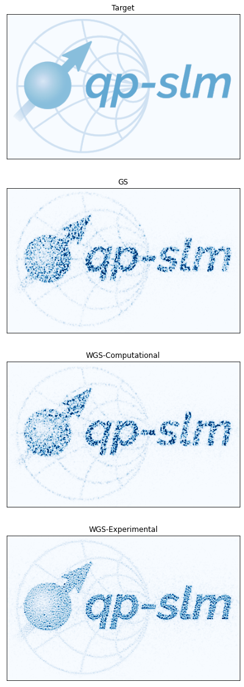

<p align="center">
<picture>
<source media="(prefers-color-scheme: dark)" srcset="docs/source/static/qp-slm-dark.svg">

</picture>
</p>

<h2 align="center">High-Performance Spatial Light Modulator Control and Holography</h2>

<p align="center">
<a href="https://slmsuite.readthedocs.io/en/latest"></a>
<a href="https://github.com/QPG-MIT/slmsuite/blob/main/LICENSE"></a>
<!--<a href="https://pepy.tech/project/slmsuite"></a>-->
<a href="https://github.com/psf/black"></a>
</p>

## Installation

[Install](https://slmsuite.readthedocs.io/en/latest/installation.html)
the latest version of `slmsuite` from GitHub using:

```console
$ pip install git+https://github.com/QPG-MIT/slmsuite
```

<!--Install the latest version of `slmsuite` from [PyPi](http://google.com) using:

```console
$ pip install slmsuite
```-->

## Documentation and Examples

Extensive
[documentation](https://slmsuite.readthedocs.io/en/latest/)
and
[API reference](https://slmsuite.readthedocs.io/en/latest/api.html)
are available through readthedocs.

Examples can be found embedded in
[documentation](https://slmsuite.readthedocs.io/en/latest/examples.html),
live through
[nbviewer](https://nbviewer.org/github/QPG-MIT/slmsuite-examples/tree/main/examples/),
or directly in
[source](https://github.com/QPG-MIT/slmsuite-examples).

<p align="center">
<picture>
<source media="(prefers-color-scheme: dark)" srcset="docs/source/static/readme-example-dark.png">

</picture>
</p>