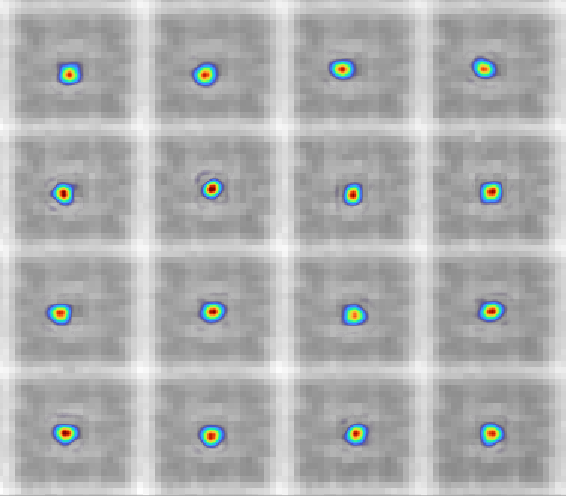
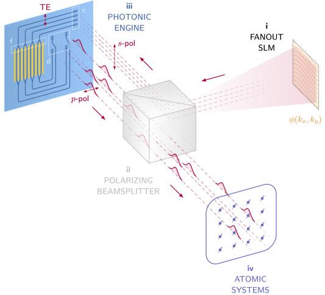
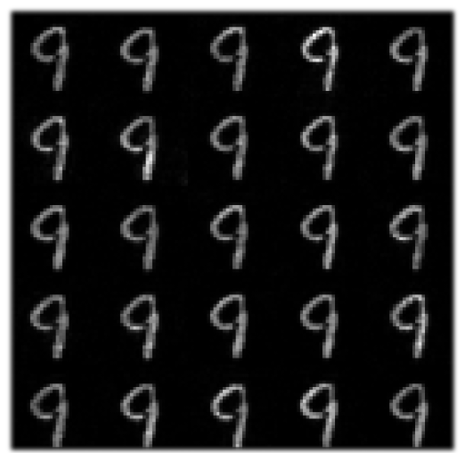

.. _why:

Why :mod:`slmsuite`?
====================

Because **using** a spatial light modulator (SLM) should be as easy as buying an SLM.

.. SLM hardware enables research, but software is lacking.

The flourishing applications of SLMs---ranging from deep-brain imaging to quantum
control---have motivated commensurate growth in affordable, high-performance commercial hardware.
Harnessing the **practical** advantages of these SLMs in demanding applications, however, is
often limited by the outdated, proprietary, or otherwise incomplete control software
available to users. Our `Quantum Photonics <https://www.rle.mit.edu/qp/>`_ research group at
MIT developed |slmsuite|_ to address these issues.

.. So we made slmsuite

Simply put, the goal of |slmsuite|_ is to enable any SLM user to efficiently project
high-precision, computer-generated holograms (compensated for non-ideal experimental
conditions!) using the latest algorithms from research. It features:

* Simple interface for controlling various SLMs and cameras,
* Automated Fourier- to image-space coordinate transformations: point to a camera pixel, and
  the Fourier-domain SLM will direct light there!
* Automated wavefront calibration to compensate for aberrations along the SLM imaging train,
* A growing suite of GPU-accelerated iterative phase retreival algorithms
  (e.g. weighted Gerchberg-Saxton) **with experimental feedback**,
* Automated evaluation metrics to monitor diffraction efficiency and image tolerances,
* ... and more to come!

.. We've now used slmsuite for state-of-the-art science.

During the initial development alone, |slmsuite|_ enabled us to tune arrays of
micro-scale optical cavities into resonance with picometer-precision, dynamically
address clusters of artificial atoms in diamond, and efficiently fan-out input activations
in optical neural networks. We're excited to see what you come up with next!

.. table::
   :widths: auto
   :align: center

   ============================ =========================== ===========================
   **Tuned Microcavity Arrays** **Dynamic Quantum Control** **Optical Neural Networks**
   ---------------------------- --------------------------- ---------------------------
   |trim|                       |atoms|                     |onn|
   ============================ =========================== ===========================

Why Python?
-----------

.. Easy and accessible to scientists.

`Python <https://www.python.org/>`_ is a simple and fast programming language.
With easy-to-learn syntax and good readability, Python is ideal for scientists and
experimentalists interested in quick development and refinement.
Itself being `open-source <https://github.com/python/cpython>`_,
Python is a goto language for open-source projects, to the point that it is the
`most pull-requested language <https://madnight.github.io/githut/#/pull_requests/2022/1>`_
on GitHub.

.. Fast and hardware-compatible due to C backend.

The default implementation of the Python language,
`CPython <https://github.com/python/cpython>`_, is built on top of C.
Scientific computing packages such as |numpy|_ and |scipy|_ implement
algorithms in fast C code, leading to a paradigm where 'heavy lifting' is done in C,
while higher-level logic or 'heavy coding' is done in the more user-friendly Python.
Importantly, the accessiblity of the C backend means that hardware interfaces
(often written in C) are
`easy to implement <https://docs.python.org/3/library/ctypes.html>`_
in Python. This is critical for
the |slmsuite|_ package, which focuses on experimental holography using physical
cameras and SLMs.

.. jupyter is cool too.

We find jupyter notebooks with
`autoreload <https://ipython.readthedocs.io/en/stable/config/extensions/autoreload.html>`_
to be exceptionally useful for
experimentation and debugging, as this produces MATLAB-like interactivity with
editable scripting.
See the jupyter notebooks in :ref:`examples` to try it out!

Why :mod:`cupy`?
----------------

.. Even faster with a GPU!

Core :mod:`~slmsuite.holography.algorithms` in |slmsuite|_ make heavy use of
fast Fourier transforms on large arrays. These problems are ideal for GPU-based
acceleration, implemented here with |cupy|_. In most cases, |cupy|_ is a
`drop-in replacement <https://docs.cupy.dev/en/stable/reference/comparison.html>`_
for |numpy|_ and |scipy|_, which are used as a backup if a GPU is not present.
We repeatably measure around two orders of magnitude speedup for standard
optimization when using |cupy|_, compared with the |numpy|_ equivalent.

.. Linked modules

.. |numpy| replace:: :mod:`numpy`
.. _numpy: https://numpy.org/

.. |scipy| replace:: :mod:`scipy`
.. _scipy: https://scipy.org/

.. |cupy| replace:: :mod:`cupy`
.. _cupy: https://cupy.dev/

.. |slmsuite| replace:: :mod:`slmsuite`
.. _slmsuite: https://github.com/QPG-MIT/slmsuite